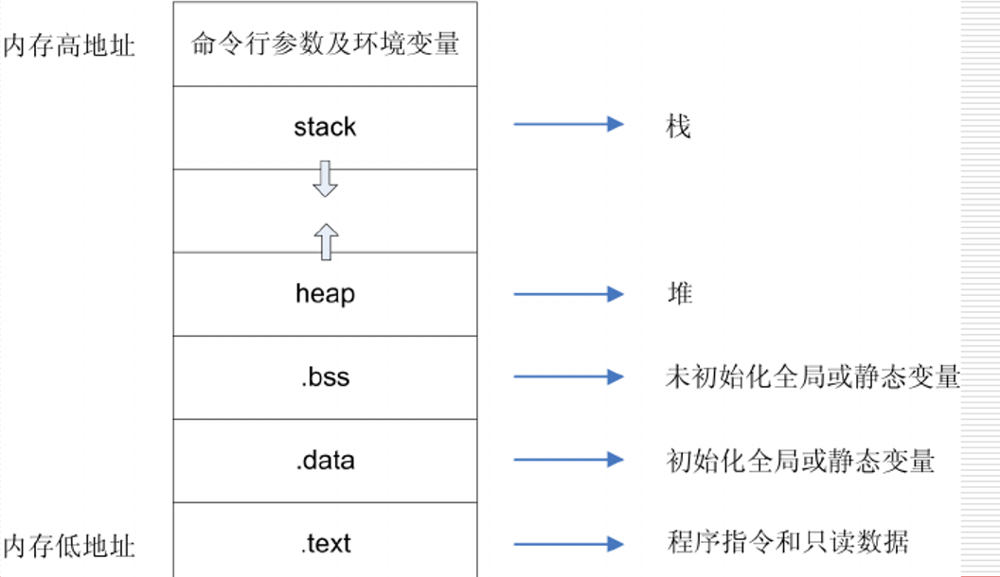
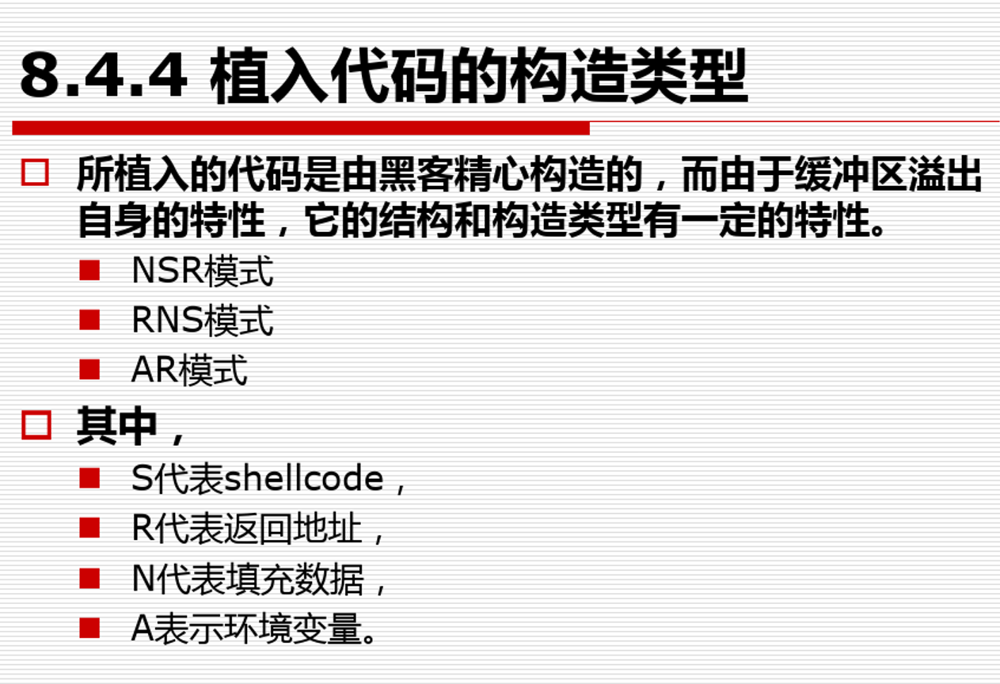

# 缓冲区溢出解决方案调研-OpenOSC
> 是一个用C编写的开源对象大小检查库。它一直是
为了推广使用编译器开发的内置对象大小检查
增强安全性的能力。它为检测提供了强大的支持
对内存和内存执行操作的各种函数中的缓冲区溢出
串。并非所有类型的缓冲区溢出都可以通过此库检测到，
但它确实为某些功能提供了额外级别的验证
可能是缓冲区溢出缺陷的根源。它同时保护C和C++代码。

## 缓冲区溢出介绍
- [网络安全攻防技术讲义-BOF](https://wenku.baidu.com/view/107e6e018c9951e79b89680203d8ce2f006665d5.html)
- 测试环境 [ubuntu-12.04](https://old-releases.ubuntu.com/releases/12.04/)

## 分类 
- 栈溢出
- 堆溢出
- BSS溢出 （未初始化的全局变量、静态变量）
- 格式化串溢出

## 原理
> 把 `objdump` 后的内容进行解析，判断是否有

## 解决方案
- [wiki-缓冲区溢出](https://en.wikipedia.org/wiki/Buffer_overflow_protection#STACKGUARD)
    - 硬件层（开销小） StackGhost
    - 内核层 Dtrace / [SystemTap](https://zhuanlan.zhihu.com/p/28680568)
    - 系统旁路用户层 
    - 编译器层 Fail-Safe-C /  [StackGuard](https://zhuanlan.zhihu.com/p/344448144) / StackShield

## 缓冲区溢出攻击的shellcode类型

## 基础使用
- 2021/8/23 必须用了这个`openosc`后才能使用？ 
